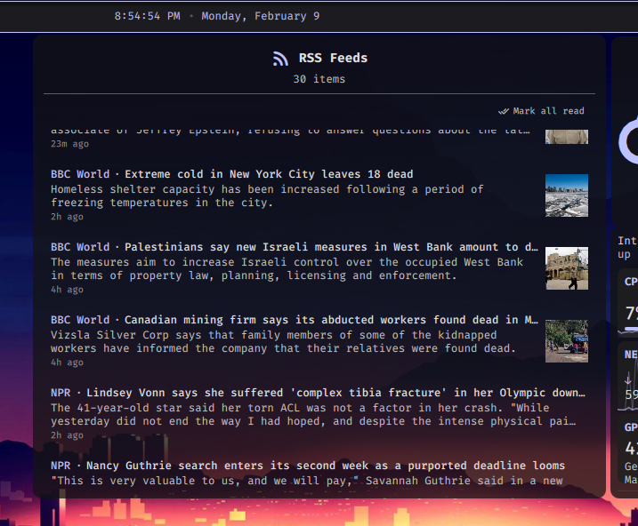

# Dank RSS Widget

A desktop widget plugin for [DankMaterialShell](https://github.com/AvengeMedia/DankMaterialShell) that displays RSS and Atom feeds directly on your desktop.

## Features

- RSS 2.0 and Atom feed support with auto-detection
- Configurable auto-refresh interval (5min - 24hr)
- Click items to open in your browser
- Add/edit/remove feeds via the settings panel
- OPML import for bulk feed migration
- Quick-add presets: US/global news, tech, Reddit communities
- Sort modes: newest first, oldest first, grouped by feed
- Compact and expanded view modes
- Thumbnail images from media:thumbnail, media:content, enclosures
- Read/unread tracking with mark-all toggle
- New item notifications via DMS toast system
- Configurable font size
- Appearance customization (background opacity, borders)
- CDATA unwrapping and HTML entity decoding
- Feed source labels per item

## Installation

### From the DMS Plugin Manager

Search for "Dank RSS Widget" in the DMS plugin manager.

### Manual Installation

Clone or symlink this repo into your DMS plugins directory:

```bash
git clone https://github.com/BrendonJL/dms-rss-widget.git
ln -s /path/to/dms-rss-widget ~/.config/DankMaterialShell/plugins/dankRssWidget
```

Reload DMS (Ctrl+Shift+R) or restart your compositor.

## Configuration

Open the widget settings to:

1. **Add feeds** — Enter a name and RSS/Atom URL, or use the quick-add presets
2. **Set refresh interval** — How often feeds are fetched (default: 30 minutes)
3. **Max items** — Limit displayed items (default: 20)
4. **Appearance** — Background opacity, border toggle/color/thickness

## Requirements

- DankMaterialShell >= 1.2.0
- `curl` (used for fetching feeds)

## Testing

The core feed-parsing logic is extracted into a standalone JS module (`tests/feed-parser.js`) that mirrors the functions in `DankRssWidget.qml`. This allows unit testing with Node.js without needing the QML runtime.

### Running Tests

```bash
node --test tests/feed-parser.test.js
```

Requires Node.js 18+ (uses the built-in `node:test` runner).

### Test Coverage

60 tests across 9 suites covering:

| Suite | Tests | What it covers |
|-------|-------|----------------|
| `extractTag` | 6 | XML tag extraction, CDATA, attributes, case-insensitivity |
| `cleanText` | 9 | HTML entity decoding (`&amp;`, `&lt;`, `&#x...;`, `&#...;`), whitespace collapsing |
| `stripHtml` | 5 | HTML tag removal, self-closing tags, attributes |
| `getRelativeTime` | 6 | Relative timestamps (just now, Xm/h/d ago), locale fallback |
| `extractImageUrl` | 9 | media:thumbnail, media:content, enclosure, inline img, entity decoding |
| `parseRssFeed` | 9 | Full RSS 2.0 parsing, CDATA titles, entity descriptions, image extraction |
| `parseAtomFeed` | 6 | Atom feed parsing, alternate link preference, updated/published dates |
| `parseFeed` | 2 | Auto-detection of RSS vs Atom format |
| `parseOpml` | 7 | OPML import, feed name/URL extraction, entity decoding |

## Screenshots



## License

MIT
