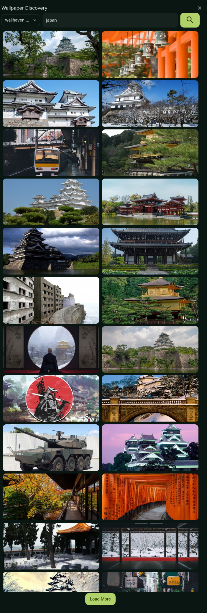

# A collection of DMS plugins

## 1 [Gitmoji Launcher](/gitmojiLauncher)

A DankMaterialShell launcher plugin that provides quick access Gitmojis.

Screenshot

## 2 [Wallpaper Discovery](/wallpaperDiscovery)

A DankMaterialShell widget that helps you find and download wallpapers.

Screenshot

## 3 [Alarm Clock](/alarmClock)

A DankMaterialShell widget for alarms, stopwatch and timer.

Screenshot

## 4 [Display Settings](/displaySettings)

A Hyprland DankMaterialShell plugin for enabling/disabling your screens.

Screenshot

