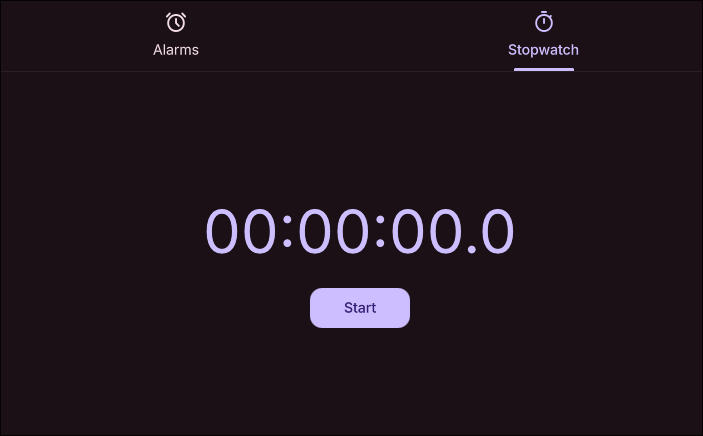

# Alarm Clock

A DankMaterialShell widget for alarms, stopwatch and timer.




## Features

- Alarms
- Stopwatch
- Timers (coming soon)

## Installation

### From Plugin Registry (Recommended)
```bash
dms plugins install alarmClock
# or install using the plugins tab on DMS settings
```

### Manual Installation
```bash
# Copy plugin to DMS plugins directory
cp -r "alarmClock" ~/.config/DankMaterialShell/plugins/

# Enable in DMS plugins tab and the widget to Dank Bar
```

## Configuration

- Set the path to the alarm audio file in the plugins settings, it must be in .wav format
- Enable notifications for alarms (default: true)
- Choose snooze time duration (default: 5 minutes)
- Choose urgency of notifications (default: critical)

## Requirements

- `qt6-multimedia` (for sound)
- `notify-send` (for notifications)
- DankMaterialShell >= 0.2.4
- Wayland compositor (Niri, Hyprland, etc.)

## Compatibility

- **Compositors**: Niri and Hyprland
- **Distros**: Universal - works on any Linux distribution

## Contributing

Found a bug? Open an issue or submit a pull request!

## License

MIT License - See LICENSE file for details

## Author

Created for the DankMaterialShell community

## Links

- [DankMaterialShell](https://github.com/AvengeMedia/DankMaterialShell)
- [Plugin Registry](https://github.com/AvengeMedia/dms-plugin-registry)
