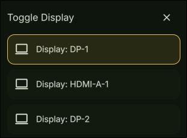

# Display Settings

A Hyprland DankMaterialShell plugin that allows you to disable/enable your displays.




## Features

Registers 3 new ipc calls to dms

- `dms ipc call displaySettings toggle`
- `dms ipc call displaySettings open`
- `dms ipc call displaySettings close`

## Installation

### From Plugin Registry (Recommended)
```bash
dms plugins install displaySettings
# or install using the plugins tab on DMS settings
```

### Manual Installation
```bash
# Copy plugin to DMS plugins directory
cp -r "displaySettings" ~/.config/DankMaterialShell/plugins/

# Enable in DMS plugins tab
# run `dms ipc call displaySettings open` to display the menu
```

## Configuration

None at the moment.

## Requirements

- DankMaterialShell >= 0.6.2
- Hyprland
    - a monitorv2 definition in your hyprland.conf file.

## Compatibility

- **Compositors**: Hyprland
- **Distros**: Universal - works on any Linux distribution

## Contributing

Found a bug or want to add more features? Open an issue or submit a pull request!

## License

MIT License - See LICENSE file for details

