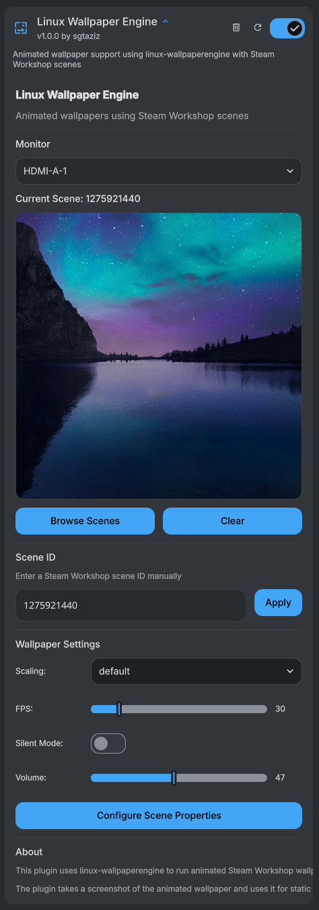

# DMS-WallpaperEngine

A DankMaterialShell plugin for [linux-wallpaperengine](https://github.com/Almamu/linux-wallpaperengine).



## Installation

### From Plugin Registry (Recommended)
1. Open DMS Settings
2. Go to Plugins tab
3. Click Browse
4. Click "Show 3rd Party Plugins" and confirm.
5. Search for Linux Wallpaper Engine

### Manual Installation
```bash
# Copy plugin to DMS plugins directory (create it if it doesn't exist)
cp -r LinuxWallpaperEngine ~/.config/DankMaterialShell/plugins/

# Enable in DMS settings under Plugins tab.
```