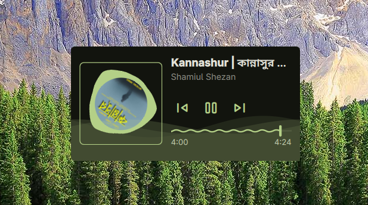

# Media Player Plugin for Dank Material Shell

A feature-rich media player widget for Dank Material Shell with MPRIS support, volume control, and a beautiful, responsive interface.

## Features

- **MPRIS Integration**: Control any media player that supports the MPRIS D-Bus interface (e.g., Spotify, VLC, MPV, Firefox).
- **Beautiful Visuals**:
    - **Dynamic Album Art**: Displays track artwork with a smooth rotation animation during playback.
    - **Animated Ocean Wave**: A unique, animated wave background that reacts to the playback state.
    - **Blurred Background**: Uses the current track's artwork to create a cohesive, blurred background effect.
- **Playback Controls**:
    - Play/Pause toggle.
    - Skip to previous and next tracks.
    - Smooth seekbar for precise track navigation.
- **Responsive Design**: Automatically adjusts its layout and scaling to fit different screen sizes and user preferences.
- **Remote Artwork Support**: Automatically downloads and caches high-quality artwork from web URLs.
- **Customizable Settings**: Adjust the background opacity to match your desktop theme.

## Configuration

You can customize the following settings in the plugin configuration:

- **Background Opacity**: Adjust the transparency of the player's background (0% to 100%).

## Technical Details

- **Type**: Desktop Widget
- **Capabilities**: `desktop-widget`, `media-player`, `mpris`, `audio-control`
- **Permissions**:
    - `settings_read` / `settings_write`: To manage user preferences.
    - `mpris_control`: To interact with media players.
    - `audio_control`: For system volume management.

## Note

> [!NOTE]
> The media player widget will only be visible when there is an active media player (e.g., Spotify, VLC, Firefox) running and playing media. If no active media session is detected, the widget will automatically hide itself.

## Installation

Ensure this plugin is placed in your Dank Material Shell plugins directory:
`~/.config/DankMaterialShell/plugins/mediaPlayer`

## Requirements

- **Quickshell**: The underlying shell framework.
- **MPRIS compatible player**: Required for media control.
- **Curl**: Used for downloading remote album art.
