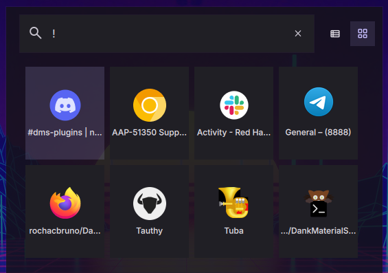
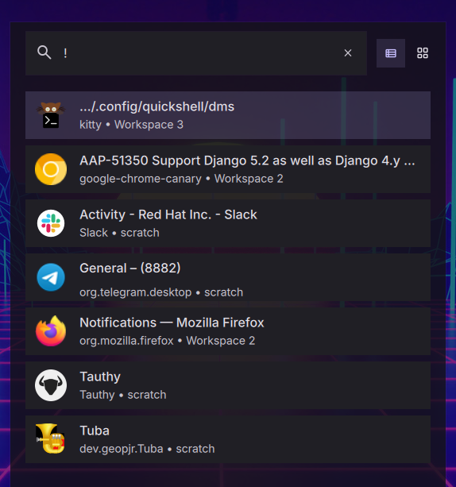

# Niri Windows Plugin for DMS Launcher

[](https://plugins.danklinux.com/niriwindows.html)

A launcher plugin that lists all open windows in the Niri window manager and allows quick switching between them.

*Example: Type `!` to list all open windows with their workspace locations*

Grid Mode




List Mode



## Features

- **Window Listing**: Displays all open windows from the Niri window manager
- **Smart Search**: Filter windows by application name, window title, or workspace
- **Quick Switching**: Click or press Enter to instantly switch to any window
- **Workspace Info**: Shows which workspace each window is on
- **Smart Sorting**: Focused windows appear first, then sorted by workspace
- **Default Trigger**: Uses `!` as the default trigger prefix (configurable)
- **Desktop Integration**: Automatically fetches application icons from desktop entries

## Installation

### Via DMS

```bash
dms plugins install NiriWindows
```

### Via DMS GUI
- Mod + ,
- Go to Plugins Tab
- Choose Browse
- Enable third party
- install NiriWindows

### Manually

```
cd ~/.config/DankMaterialShell/plugins
git clone https://github.com/rochacbruno/DankNiriWindows NiriWindows
```

1. Open DMS Settings (Ctrl+,)
2. Navigate to Plugins tab
3. Click "Scan for Plugins"
4. Enable the "NiriWindow" plugin with the toggle switch

## Requirements

- **Niri Window Manager**: This plugin only works when DMS is running on Niri WM
- **DMS Version**: Requires DMS version > 0.1.18

## Usage

### With Default Settings (! Trigger)

1. Open the launcher (Ctrl+Space)
2. Type `!` followed by a search term: `!firefox`
3. All matching windows appear in the launcher
4. Press Enter to switch to the selected window

### Searching for Windows

- **By application**: `!firefox` - Shows all Firefox windows
- **By title**: `!document` - Shows windows with "document" in the title
- **By workspace**: `!Workspace 2` - Shows windows on Workspace 2
- **All windows**: `!` - Shows all open windows

### Customizing the Trigger

You can configure a different trigger prefix or disable it entirely in the settings:

1. Open Settings → Plugins → Niri Windows
2. Change the trigger to a custom value (e.g., `win`, `@`, `w`)
3. Or check "No trigger (always active)" to remove the prefix requirement
4. In the launcher, type your configured trigger: `win firefox` or just `firefox` (if no trigger)


### Adding a keybinding (niri)

```kdl
binds {
      Alt+Tab hotkey-overlay-title="Switch Windows" {
        spawn "dms" "ipc" "call" "spotlight" "openQuery" "!";
    }
}
```


## Window Information Display

Each window item shows:
- **Name**: Window title (or application name if no title)
- **Icon**: Application icon from desktop entry
- **Comment**: Application ID and workspace location

Example:
```
Window Title
org.mozilla.firefox • Workspace 1
```

## Sorting Behavior

Windows are sorted in the following order:
1. Currently focused window (appears first)
2. Workspace index (lower workspace numbers first)
3. Window name (alphabetically)

## How It Works

The plugin integrates with DMS's NiriService to:
1. Monitor all open windows via Niri's event stream
2. Track window properties (app_id, title, workspace, focus state)
3. Use `NiriService.focusWindow(windowId)` to switch windows
4. Update the list in real-time when windows open/close

## Configuration

Settings are stored in `~/.config/DankMaterialShell/plugin_settings.json` under the `niriWindows` plugin key:

```json
{
  "pluginSettings": {
    "niriWindows": {
      "trigger": "!",
      "noTrigger": false
    }
  }
}
```

## Troubleshooting

**No windows appear:**
- Make sure you're running DMS on Niri window manager
- Check that the plugin is enabled in Settings → Plugins
- Verify you have open windows

**Plugin doesn't work:**
- This plugin only works on Niri WM, not Hyprland or other compositors
- Make sure DMS version is > 0.1.18

**Wrong icons showing:**
- Icons are fetched from desktop entries using heuristic lookup
- Some applications may not have proper desktop entries

## Files

- `plugin.json` - Plugin manifest and metadata
- `NiriWindowsLauncher.qml` - Main launcher component
- `NiriWindowsSettings.qml` - Settings UI
- `README.md` - This documentation file
- `screenshot.png` - Plugin screenshot

## Version

1.0.0

## Author

DMS Team

## License

Same as DankMaterialShell
